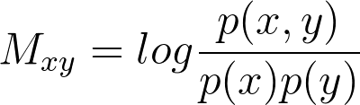
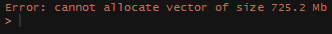
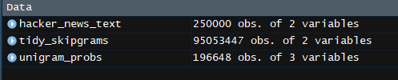
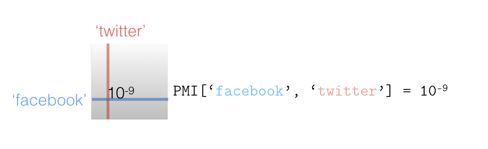
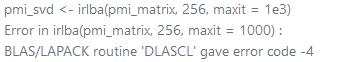
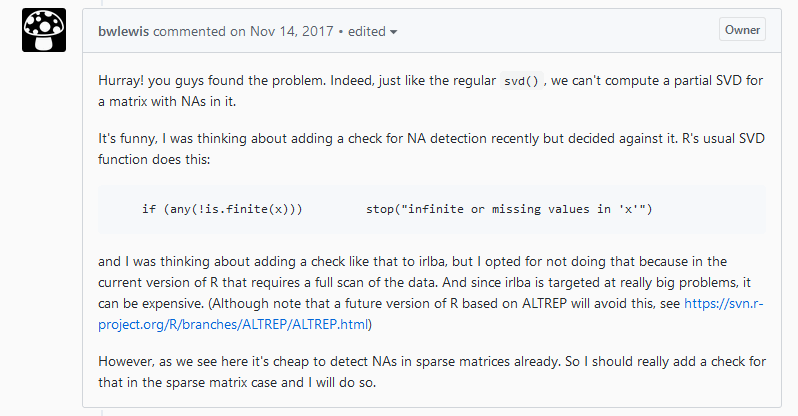
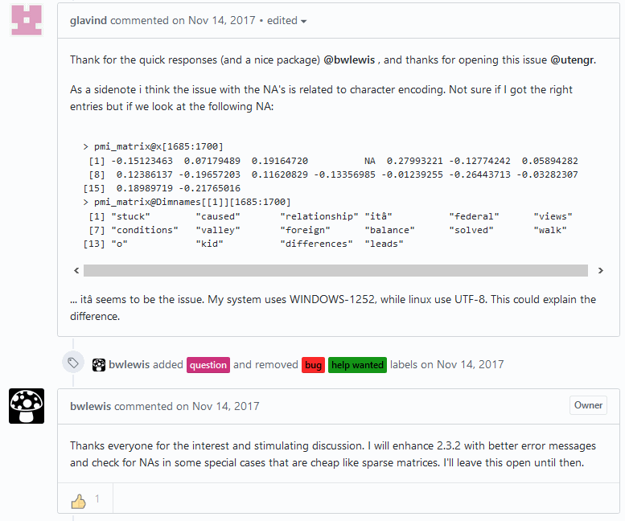
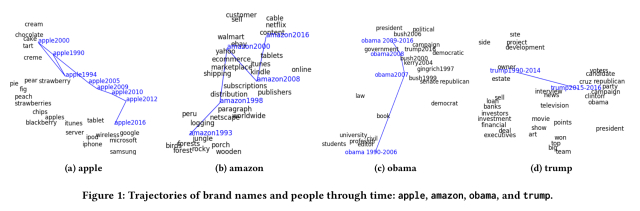
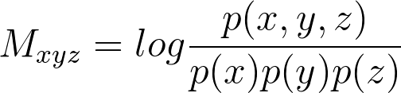

<script>
  (function(i,s,o,g,r,a,m){i['GoogleAnalyticsObject']=r;i[r]=i[r]||function(){
  (i[r].q=i[r].q||[]).push(arguments)},i[r].l=1*new Date();a=s.createElement(o),
  m=s.getElementsByTagName(o)[0];a.async=1;a.src=g;m.parentNode.insertBefore(a,m)
  })(window,document,'script','//www.google-analytics.com/analytics.js','ga');

  ga('create', 'UA-317478-17', 'auto');
  ga('send', 'pageview');

</script>

<script src='https://ajax.googleapis.com/ajax/libs/jquery/2.2.0/jquery.min.js'></script>
<script>
$(window).bind('load', function() {
  Reveal.addEventListener('slidechanged', function(event) {
    console.log('Slide Index: ' + event.indexh);
    ga('send', 'event', 'Slide Index', 'click', event.indexh);
  });
});
</script>


<div class="guide horz" style="height: 0%; width: 100%; top: 10%; left: 0%"></div>
<div class="guide horz" style="height: 0%; width: 100%; top: 20%; left: 0%"></div>
<div class="guide horz" style="height: 0%; width: 100%; top: 30%; left: 0%"></div>
<div class="guide horz" style="height: 0%; width: 100%; top: 40%; left: 0%"></div>
<div class="middle-guide horz" style="height: 0%; width: 100%; top: 50%; left: 0%"></div>
<div class="guide horz" style="height: 0%; width: 100%; top: 60%; left: 0%"></div>
<div class="guide horz" style="height: 0%; width: 100%; top: 70%; left: 0%"></div>
<div class="guide horz" style="height: 0%; width: 100%; top: 80%; left: 0%"></div>
<div class="guide horz" style="height: 0%; width: 100%; top: 90%; left: 0%"></div>

<div class="guide vert" style="height: 100%; width: 0%; top: 0%; left: 10%"></div>
<div class="guide vert" style="height: 100%; width: 0%; top: 0%; left: 20%"></div>
<div class="guide vert" style="height: 100%; width: 0%; top: 0%; left: 30%"></div>
<div class="guide vert" style="height: 100%; width: 0%; top: 0%; left: 40%"></div>
<div class="middle-guide vert" style="height: 100%; width: 0%; top: 0%; left: 50%"></div>
<div class="guide vert" style="height: 100%; width: 0%; top: 0%; left: 60%"></div>
<div class="guide vert" style="height: 100%; width: 0%; top: 0%; left: 70%"></div>
<div class="guide vert" style="height: 100%; width: 0%; top: 0%; left: 80%"></div>
<div class="guide vert" style="height: 100%; width: 0%; top: 0%; left: 90%"></div>


Using TidyText to Streamline NLP Workflows
===
author: Dennis Chandler
date: 14 June, 2018
width: 1500
height: 800
transition: linear
transition-speed: fast
css: rpres.css
class: larger
<!-- NOTE: Styling and external images may be missing --> 

<p>R Enthusiast
  <br/>
  St. Louis, MO
  <br/>
</p>


What is "Text Mining with R"?
===
class: larger center-img

* Package for "Tidy" Analysis of Text
* Ability to work with Various Text Analysis Formats


Tidy Text Format
===
class: larger
* Asimov Quotes


```
[1] "Violence is the last refuge of the incompetent"                                                                                             
[2] "The saddest aspect of life right now is that science gathers knowledge faster than society gathers wisdom"                                  
[3] "People who think they know everything are a great annoyance to those of us who do"                                                          
[4] "The most exciting phrase to hear in science, the one that heralds new discoveries, is not 'Eureka!' (I've found it!), but 'That's funny...'"
```

Tidy Text Format
===


```r
library(tidytext); library(tidyverse)
text_df <- data_frame(line = 1:4, text = text)
text_df <- unnest_tokens(text_df, word, text)
text_df
```

```
# A tibble: 64 x 2
    line word       
   <int> <chr>      
 1     1 violence   
 2     1 is         
 3     1 the        
 4     1 last       
 5     1 refuge     
 6     1 of         
 7     1 the        
 8     1 incompetent
 9     2 the        
10     2 saddest    
# ... with 54 more rows
```

Format Advantages
===

```r
text_df %>% count(word, sort = TRUE)
```

```
# A tibble: 51 x 2
   word          n
   <chr>     <int>
 1 the           5
 2 is            3
 3 of            3
 4 gathers       2
 5 science       2
 6 that          2
 7 to            2
 8 who           2
 9 a             1
10 annoyance     1
# ... with 41 more rows
```

N-Grams!!
===


```r
text_df <- data_frame(line = 1:4, text = text)
text_df <- unnest_tokens(text_df, ngram, text, token = "ngrams", n =3)
text_df
```

```
# A tibble: 56 x 2
    line ngram             
   <int> <chr>             
 1     1 violence is the   
 2     1 is the last       
 3     1 the last refuge   
 4     1 last refuge of    
 5     1 refuge of the     
 6     1 of the incompetent
 7     2 the saddest aspect
 8     2 saddest aspect of 
 9     2 aspect of life    
10     2 of life right     
# ... with 46 more rows
```

Additional Items
===
class: larger
* Built in stop_words
  * onix, SMART, & snowball
  * http://www.lextek.com/manuals/onix/stopwords1.html
  * http://www.jmlr.org/papers/volume5/lewis04a/lewis04a.pdf
  * http://snowball.tartarus.org/algorithms/english/stop.txt

* Use dplyr's anti_join or use other techniques

```
# A tibble: 3 x 2
  lexicon      n
  <chr>    <int>
1 onix       404
2 SMART      571
3 snowball   174
```

Text Analysis
===
class: smaller
* Novel Example, The War of the Worlds by H.G. Wells


```r
library(gutenbergr); library(stringr)
novel <- gutenberg_download(36)
chapter <- mutate(novel, linenumber = row_number(),
        chapter = cumsum(str_detect(text,
        regex("^chapter ", ignore_case = TRUE))))
tail(chapter)
```

```
# A tibble: 6 x 4
  gutenberg_id text                                     linenumber chapter
         <int> <chr>                                         <int>   <int>
1           36 the tumult of playing children, and to ~       6469      27
2           36 all bright and clear-cut, hard and sile~       6470      27
3           36 great day. . . .                               6471      27
4           36 ""                                             6472      27
5           36 And strangest of all is it to hold my w~       6473      27
6           36 that I have counted her, and that she h~       6474      27
```

All Columns Preserved
===
class: smaller

```r
token_novel <- unnest_tokens(chapter, word, text)
tail(token_novel, 15)
```

```
# A tibble: 15 x 4
   gutenberg_id linenumber chapter word   
          <int>      <int>   <int> <chr>  
 1           36       6473      27 think  
 2           36       6474      27 that   
 3           36       6474      27 i      
 4           36       6474      27 have   
 5           36       6474      27 counted
 6           36       6474      27 her    
 7           36       6474      27 and    
 8           36       6474      27 that   
 9           36       6474      27 she    
10           36       6474      27 has    
11           36       6474      27 counted
12           36       6474      27 me     
13           36       6474      27 among  
14           36       6474      27 the    
15           36       6474      27 dead   
```

Sentiment
===
* Built in sentiment lexicons
  * AFINN, bing, nrc, and loughran
  * http://www2.imm.dtu.dk/pubdb/views/publication_details.php?id=6010
  * https://www.cs.uic.edu/~liub/FBS/sentiment-analysis.html
  * http://saifmohammad.com/WebPages/NRC-Emotion-Lexicon.htm
  * http://www3.nd.edu/~mcdonald/Word_Lists.html

* Use dplyr's inner_join or use other techniques

```
# A tibble: 4 x 2
  lexicon      n
  <chr>    <int>
1 AFINN     2476
2 bing      6788
3 loughran  4149
4 nrc      13901
```

Putting it all Together
===
class: graph-img smaller
* Look over 80 lines

```r
WOTW_sentiment <- token_novel %>% inner_join(get_sentiments("bing")) %>%
  count(index = linenumber %/% 80, sentiment) %>% spread(sentiment, n, fill = 0) %>%
  mutate(sentiment = positive - negative)

ggplot(WOTW_sentiment, aes(index, sentiment, fill = 'red')) +
         geom_col(show.legend = FALSE)
```


TF-IDF
===
class: graph-img smaller
* TF-IDF per Chapter

```r
token_novel <- unnest_tokens(chapter, word, text) %>%
               count(chapter, word, sort = TRUE) %>% ungroup()

chapter_novel <- bind_tf_idf(token_novel, word, chapter, n)
chapter_novel <- arrange(chapter_novel, desc(tf_idf))
chapter_novel[10:20,]
```

```
# A tibble: 11 x 6
   chapter word           n      tf   idf tf_idf
     <int> <chr>      <int>   <dbl> <dbl>  <dbl>
 1       0 wells          1 0.0196  3.33  0.0653
 2       0 anatomy        1 0.0196  2.64  0.0517
 3       0 melancholy     1 0.0196  2.64  0.0517
 4       0 book           1 0.0196  1.95  0.0382
 5       0 shall          1 0.0196  1.54  0.0302
 6      25 ulla          28 0.00901 3.33  0.0300
 7       0 war            1 0.0196  1.25  0.0246
 8      16 brother       50 0.0113  1.72  0.0195
 9       0 are            2 0.0392  0.442 0.0173
10      23 weed          11 0.00873 1.54  0.0134
11       6 mirror         4 0.00474 2.64  0.0125
```

Other Text Data Formats
===
class: larger
* Commonly used schema is Document Term Matrix (DTM)
* Also Document-Feature Matrix (DFM)
* Used in tm, topicmodels, Quanteda, and several other packages
* DTMs and DFMs are usually in a Bag-of-Words structure
<br/>
<br/>
tidy() converts to a 'tidy' dataset
  * Will remove zero occuring words
  * Will create columns for document, word, and count
  * Will preserve Metadata

Coverting to other formats
===
class: larger
* cast_tdm( ) -> Term Document Matrix (tm package)
* cast_dtm( ) -> Document Term Matrix (tm package)
* cast_dfm( ) -> Document-Feature Matrix (quanteda package)


* Can just cast_sparse( ) for generic sparse matrix

Workflow
===
class: center-img


Initial Motivation: word2vec
===
class: larger center-img
* Deep Learning to Understand Language
* StitchFix Blog on Alternative Method
  * Chris Moody; Multithreaded - October 18th, 2017
* Information Theory of Pointwise Mutual Information




Let's Implement!
===

```r
library(bigrquery)
library(tidyverse)

project <- "my-first-project-184914"

sql <- "#legacySQL
 SELECT
   stories.title AS title,
   stories.text AS text
 FROM
   [bigquery-public-data:hacker_news.full] AS stories
 WHERE
   stories.deleted IS NULL
 LIMIT
   250000"

hacker_news_raw <- query_exec(sql, project = project, max_pages = Inf)
```

Let's find p(x) and p(y)
===
class: smaller


```r
unigram_probs <- hacker_news_text %>%
  unnest_tokens(word, text) %>%
  count(word, sort = TRUE) %>%
  mutate(p = n / sum(n))

unigram_probs
```

```
# A tibble: 196,648 x 3
   word       n      p
   <chr>  <int>  <dbl>
 1 the   547784 0.0404
 2 to    380822 0.0281
 3 a     335134 0.0247
 4 of    269871 0.0199
 5 and   264712 0.0195
 6 i     232058 0.0171
 7 x27   219078 0.0162
 8 is    215909 0.0159
 9 that  213736 0.0158
10 it    201173 0.0148
# ... with 196,638 more rows
```

Now p(x,y)
===
class: center-img

```r
library(widyr)

tidy_skipgrams <- hacker_news_text %>%
  unnest_tokens(ngram, text, token = "ngrams", n = 8) %>%
  mutate(ngramID = row_number()) %>% 
  unite(skipgramID, postID, ngramID) %>%
  unnest_tokens(word, ngram)

skipgram_probs <- tidy_skipgrams %>%
  pairwise_count(word, skipgramID, diag = TRUE, sort = TRUE) %>%
  mutate(p = n / sum(n))
```

Now p(x,y)
===
class: center-img

```r
library(widyr)

tidy_skipgrams <- hacker_news_text %>%
  unnest_tokens(ngram, text, token = "ngrams", n = 8) %>%
  mutate(ngramID = row_number()) %>% 
  unite(skipgramID, postID, ngramID) %>%
  unnest_tokens(word, ngram)

skipgram_probs <- tidy_skipgrams %>%
  pairwise_count(word, skipgramID, diag = TRUE, sort = TRUE) %>%
  mutate(p = n / sum(n))
```


Now p(x,y)
===
class: center-img

```r
library(widyr)

tidy_skipgrams <- hacker_news_text %>%
  unnest_tokens(ngram, text, token = "ngrams", n = 8) %>%
  mutate(ngramID = row_number()) %>% 
  unite(skipgramID, postID, ngramID) %>%
  unnest_tokens(word, ngram)

skipgram_probs <- tidy_skipgrams %>%
  pairwise_count(word, skipgramID, diag = TRUE, sort = TRUE) %>%
  mutate(p = n / sum(n))
```



p(x,y) continued
===
class: center-img

```r
normalized_prob <- skipgram_probs %>%
  filter(n > 20) %>%
  rename(word1 = item1, word2 = item2) %>%
  left_join(unigram_probs %>%
              select(word1 = word, p1 = p), by = "word1") %>%
  left_join(unigram_probs %>%
              select(word2 = word, p2 = p), by = "word2") %>%
  mutate(p_together = p / p1 / p2
```


PMI Matrix
===
class: center-img

```r
pmi_matrix <- normalized_prob %>%
  mutate(pmi = log10(p_together)) %>%
  cast_sparse(word1, word2, pmi)
```


Dimension Reduction into Word Vectors
===
* The augmented implicitly restarted Lanczos bidiagonalization algorithm (IRLBA) finds a few ap-
proximate largest (or, optionally, smallest) singular values and corresponding singular vectors of a
sparse or dense matrix using a method of Baglama and Reichel.  It is a fast and memory-efficient
way to compute a partial SVD.

```r
library(irlba)

pmi_svd <- irlba(pmi_matrix, 256, maxit = 1e3)
```

Dimension Reduction into Word Vectors
===
class: center-img
* The augmented implicitly restarted Lanczos bidiagonalization algorithm (IRLBA) finds a few ap-
proximate largest (or, optionally, smallest) singular values and corresponding singular vectors of a
sparse or dense matrix using a method of Baglama and Reichel.  It is a fast and memory-efficient
way to compute a partial SVD.

```r
library(irlba)

pmi_svd <- irlba(pmi_matrix, 256, maxit = 1e3)
```
<br/>


When all else fails...
===
class: center-img


But why NA's?
===

But why NA's?
===
class:center-img


Dimension Reduction into Word Vectors
===
class: smaller

```r
library(irlba)

pmi_svd <- irlba(pmi_matrix, 256, maxit = 1e3)

word_vectors <- pmi_svd$u
rownames(word_vectors) <- rownames(pmi_matrix)
```

```
               V1           V2           V3           V4          V5
the  -0.018315653  0.004973146 -0.038777857 -0.006393766 -0.02050269
to   -0.041313708  0.018954042 -0.077170174 -0.021065735 -0.01003631
a    -0.019219855  0.019526813 -0.020567201 -0.031538382  0.01400233
and   0.019921075 -0.039796364 -0.036157085  0.047092081 -0.01950567
of   -0.001201721 -0.010269622 -0.052927814  0.025474243 -0.04899882
that -0.050997499  0.012205634 -0.074842144 -0.020170042 -0.01287471
x27  -0.109807935  0.035382684 -0.044326596 -0.069429378  0.01867271
is   -0.036763421  0.008950814 -0.068116216 -0.036233972  0.01980432
i    -0.114051408  0.047364811  0.005171922 -0.074395070  0.03745608
it   -0.091467524  0.033111807 -0.045517237 -0.055687987  0.02135267
```

Word Vectors... Now what?
===
* 49,422 words as a 256 size vector
<br/>

```r
library(broom)

search_synonyms <- function(word_vectors, selected_vector) {
  
  similarities <- word_vectors %*% selected_vector %>%
    tidy() %>%
    rename(token = .rownames,
           similarity = unrowname.x.)
  
  similarities %>%
    arrange(-similarity)    
}
```

Let's see what we have...
===

Let's see what we have...
===
class: smaller

```r
facebook <- search_synonyms(word_vectors, word_vectors["facebook",])
head(facebook, 10)
```

```
       token similarity
1   facebook 0.07303870
2     google 0.05226809
3    twitter 0.05034749
4     social 0.04780861
5    account 0.03941855
6         fb 0.03551794
7        etc 0.02816255
8        app 0.02742218
9  instagram 0.02501199
10     login 0.02378864
```

Let's see what we have...
===
class: smaller

```r
haskell <- search_synonyms(word_vectors, word_vectors["haskell",])
head(haskell, 10)
```

```
         token similarity
1      haskell 0.05428521
2         lisp 0.04642205
3    languages 0.04387561
4   functional 0.04087069
5      clojure 0.03778325
6        scala 0.03710879
7     language 0.03533238
8  programming 0.02877087
9       erlang 0.02774153
10        java 0.02593245
```

Word Math
===


Word Math
===
class: smaller

```r
mystery_product <- word_vectors["iphone",] - word_vectors["apple",] + word_vectors["microsoft",]
head(search_synonyms(word_vectors, mystery_product), 20)
```

```
       token similarity
1    windows 0.02721096
2          7 0.02402575
3     iphone 0.02281845
4      phone 0.02255886
5     office 0.01802380
6     mobile 0.01756828
7          6 0.01734562
8       cell 0.01715644
9    android 0.01678512
10         8 0.01613067
11      anti 0.01603111
12  projects 0.01434070
13       use 0.01397506
14    phones 0.01358735
15   battery 0.01350073
16 microsoft 0.01330761
17     nexus 0.01313012
18       new 0.01286196
19   desktop 0.01254406
20      home 0.01240648
```

Word Math
===
class: smaller

```r
mystery_product <- word_vectors["iphone",] - word_vectors["apple",] + word_vectors["amazon",]
head(search_synonyms(word_vectors, mystery_product),20)
```

```
      token similarity
1    amazon 0.06712728
2       aws 0.05199616
3        s3 0.03739996
4       ec2 0.03384358
5      book 0.03358123
6  services 0.03220372
7     books 0.03123806
8   service 0.02875673
9     cloud 0.02774119
10   online 0.02604089
11    price 0.02549487
12   kindle 0.02532448
13  hosting 0.02355045
14  storage 0.02234644
15     card 0.02234487
16   docker 0.02214886
17   heroku 0.02081644
18        6 0.02049478
19   iphone 0.02035172
20      rds 0.02021610
```

Beyond Word Vectors
===
class: smaller
Dynamic Word Embeddings for Evolving Semantic Discovery <br/>
Zijun Yao, Yifan Sun, Weicong Ding, Nikhil Rao, Hui Xiong <br/>
(Submitted on 2 Mar 2017 (v1), last revised 13 Feb 2018 (this version, v2))

    Word evolution refers to the changing meanings and associations of words throughout time, as a byproduct of human language evolution. By studying word evolution, we can infer social trends and language constructs over different periods of human history. However, traditional techniques such as word representation learning do not adequately capture the evolving language structure and vocabulary. In this paper, we develop a dynamic statistical model to learn time-aware word vector representation. We propose a model that simultaneously learns time-aware embeddings and solves the resulting "alignment problem". This model is trained on a crawled NYTimes dataset. Additionally, we develop multiple intuitive evaluation strategies of temporal word embeddings. Our qualitative and quantitative tests indicate that our method not only reliably captures this evolution over time, but also consistently outperforms state-of-the-art temporal embedding approaches on both semantic accuracy and alignment quality. 

Comments: 	9 pages, published in the International Conference on Web Search and Data Mining (WSDM 2018) <br/>
Subjects: 	Computation and Language (cs.CL); Machine Learning (stat.ML) <br/>
DOI: 	10.1145/3159652.3159703 <br/>
Cite as: 	arXiv:1703.00607 [cs.CL] <br/>

https://arxiv.org/abs/1703.00607

Beyond Word Vectors
===
class: center-img


Can do the same with TidyText
===
<br/>
<br/>


Can do the same with TidyText
===
<br/>
<br/>

<br/>
hosvd() from rTensor Package??

===
class: larger-500 center-txt
<br/>
Thank You

