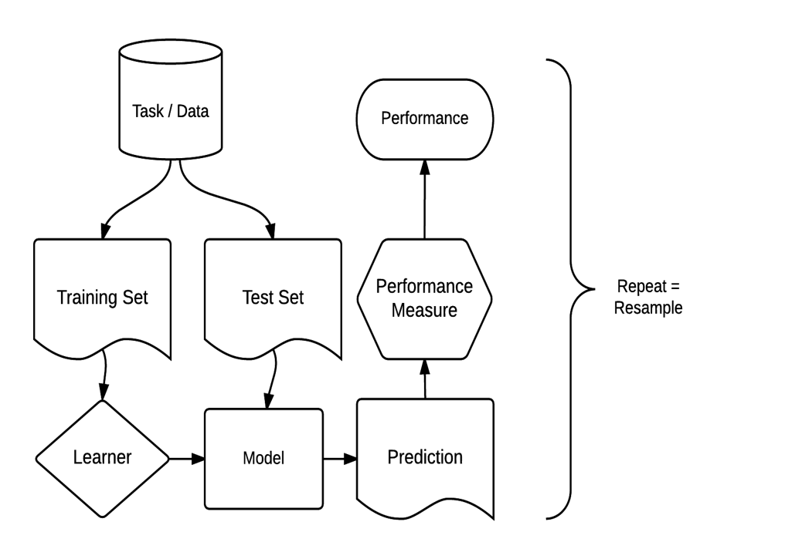

```{r setup, include=FALSE}
options(htmltools.dir.version = FALSE)
knitr::opts_chunk$set(echo = TRUE, warning = FALSE, message = FALSE)
```
```{r, echo=FALSE}
library(data.table)
library(mlr3)
library(DT)
```
# Intro 
Topic Overview
- what we won't be covering
  - this is not a machine learning how-to
  - we won't be going in-depth on feature engineering, resampling, model selection, etc.

- what we will be covering
  - overview of mlr3 and the mlr3 family of packages
  - several small demos, and
  - a bigger demo that puts it all together

- the dataset we'll be using for the demos is the attrition dataset from the rsample package.
 - I've set aside 15% of the dataset to be used as "new data"
 - the demos make no attempt to create good models - only to show the tools and workflow of mlr3
    - no feature engineering done, no features removed
    - some things are done to show an example of a step, not because they're logical:)
---
# Notes

<b>Keep in mind:</b>
- mlr3 (and extension packages) are under active development

- examples today may not  work next week

- if something breaks, the [documentation](https://mlr3.mlr-org.com/index.html) is very good, and updated often

- this is a <strong>BIG</strong> topic, we won't cover it all
 - read the docs, and check the references at the end of this deck
 
- there is some different terminology and syntax
 - don't get hung up on the differences and quirks
 - some of this may offend your normal R sensibilities
 
 


---

# Machine Learning in R: Current State
.pull-left[
.large[<strong>Individual Packages</strong>

- C5.0
- earth
- glm
- glmnet
- keras
- randomForest
- ranger
- rpart
- xgboost
- many others!]
]

.pull-right[
.large[<strong>Meta Packages</strong>

Current Generation
- Caret
- mlr

Next Generation
- tidymodels
- mlr3]
]

R does not define a standardized interface for its machine-learning algorithms. Therefore, for any non-trivial experiments, you need to write lengthy, tedious and error-prone wrappers to call the different algorithms and unify their respective output.

Additionally you need to implement infrastructure to:

- resample your models
- optimize hyperparameters
- select features
- cope with pre- and post-processing of data and compare models in a statistically meaningful way.


---
# Why mlr3?
<strong>mlr</strong>

- mlr was first released to CRAN in 2013

- now has over <b><font color = "red">30,000</font></b> lines of code

- over <b><font color = "red">120</font></b> direct dependencies and over <strong>1400</strong> indirect dependencies

- dependency API changes break mlr

- unit testing takes a long time, and most tests are disabled to comply with CRAN policies

- S3 object oriented (OO) toolkit has limitations in large projects

- NAMESPACE has > <b><font color = "red">1200</font></b> lines, > 440 export functions and objects.

- only works on in-memory data

- no nested parallelization

- too difficult to extend, maintain, and add new features 

- complex code base makes it difficult for new contributors

---
# mlr3 architectural changes
<strong>mlr3</strong>
- utilizes R6 OO toolkit

- truly object-oriented: data and methods together

  - inheritance
  - reference semantics

- embrace data.table, both for arguments and internal data structures

- light on dependencies 
 - ~ 10 packages, 4 of which are developed by mlr team
 - R6, data.table, Metrics, lgr, digest, uuid, mlbench 

- utilizes future and future.apply for parallelization

- only basic building blocks are in the core mlr3 package

- extra packages contain additional features and capabilities

---
# mlr3 workflow
.pull-left[
The mlr3 package provides R6 classes for the essential building blocks of the machine learning workflow:
- A <strong>task</strong> encapsulates the data along with additional information, such as what the prediction target is.

- A <strong>learner</strong> encapsulates one of R's many machine learning algorithms and allows to train models and make predictions. Most learners have hyperparameters that affect their operation.

- A <strong>measure</strong> computes a numeric score based on predicted and ground-truth values and their difference.

- A <strong>resampling</strong> strategy specifies a series of train and test sets and is used to assess the performance of an algorithm.
]

.pull-right[

]

---

# mlr3 and its extension packages

| Package | Functionality |
| :-      | :------------ |
| `mlr3`  | Framework for machine learning: `Task`, `Learner`, `resample()` and `benchmark()` |
| `mlr3learners` | Concrete `Learner`s for many popular machine learning implementations |
| `mlr3pipelines` | Dataflow programming of machine learning workflows. |
| `mlr3tuning` | Hyperparameter tuning for machine learning algorithms. |
| `mlr3filter` | Feature filtering |
| `mlr3viz` | Visualisations and plots |
| `paradox` | Auxiliary package providing (hyper)parameter handling |
| `mlr3misc` | Auxiliary functions |
| `mlr3fswrap` | Variable selection wrappers |
| `mlr3survival` | Extensions for survival analysis |
| `mlr3ordinal` | Extensions for ordinal regression |
| `mlr3spatiotemporal` | Extensions for spatiotemporal resampling methods |
| `mlr3hyperband` | Implements the "hyperband" approach for hyperparameter tuning |

???
mlr3fswrap	Variable selection wrappers like sequential forward/backward search, exhaustive search, or genetic algorithms.
---
# mlr3 extension packages <strong>planned</strong>

| Package | Functionality |
| :-      | :------------ |
| `mlr3cluster` | Extensions for cluster analysis |
| `mlr3fda` | Extensions for functional data analysis |
| `mlr3forecasting` | Extensions for forecasting |
| `mlr3keras` | Extnensions for deep learning via keras |
| `mlr3extralearners` | Extension to source additional learners from remote sources |

---

# mlr3 overview
pre-defined tasks, learners, resamplings, and measures are stored in the following R6 dictionaries:
- mlr_tasks
- mlr_learners
- mlr_resamplings
- mlr_measures


<b>mlr_tasks: built-in data sets</b>
```{r}
as.data.table(mlr_tasks)[,.(key, task_type)]

```

---
# mlr3 learners: base package
```{r}
as.data.table(mlr_learners)[,list(key,packages, predict_types)]
```

---

# mlr3 learners: extension package loaded
```{r}
library(mlr3learners)
as.data.table(mlr_learners)[,list(key,packages, predict_types)]
```

---

# mlr3 resamplings
```{r}
as.data.table(mlr_resamplings)
```

---

# mlr3 measures
.pull-left[
```{r}
as.data.table(mlr_measures)[task_type == "classif"][,.(key)]
```
]

.pull-right[
```{r}
as.data.table(mlr_measures)[task_type != "classif", .(key)]
```

]

---

# mlr3 filters
|Name |	Task Type |	Feature Types |	Package |
| :-  | :---------| :-------------| :-------|
| `anova` |	Classif | Integer, Numeric | stats |
| `auc` | Classif |	Integer, Numeric | Metrics|
| `carscore` | Regr |	Numeric | care
| `cmim` | Classif & Regr |	Integer, Numeric, Factor, Ordered |	praznik |
| `correlation` | Regr |	Integer, Numeric | stats |
| `disr` | Classif |	Integer, Numeric, Factor, Ordered |	praznik |
| `importance` | Universal |	Logical, Integer, Numeric, Character, Factor, Ordered |	rpart|
| `information_gain` | Classif & Regr |	Integer, Numeric, Factor, Ordered |	FSelectorRcpp|
| `jmi` | Classif |	Integer, Numeric, Factor, Ordered |	praznik |
| `jmim` | Classif |	Integer, Numeric, Factor, Ordered |	praznik |
| `kruskal_test` |	Classif |	Integer, Numeric |	stats |
| `mim` | Classif |	Integer, Numeric, Factor, Ordered |	praznik |
| `mrmr` | Classif & Regr |	Numeric, Factor, Integer, Character, Logical |	praznik |
| `njmim` |	Classif	Integer, Numeric, Factor, Ordered |	praznik |
| `performance` | Universal |	Logical, Integer, Numeric, Character, Factor, Ordered |	rpart |
| `variance` | Classif & Regr |	Integer, Numeric | stats |

---

# installation

Install the mlr3 packages from [Github](https://github.com/mlr-org):

```{r, eval=FALSE}
remotes::install_github("mlr-org/mlr3")
remotes::install_github("mlr-org/mlr3db")
remotes::install_github("mlr-org/mlr3viz")
remotes::install_github("mlr-org/mlr3learners")
remotes::install_github("mlr-org/mlr3tuning")
remotes::install_github("mlr-org/mlr3filters")
remotes::install_github("mlr-org/mlr3pipelines")
```


.footnote[
[1] Check [mlr3 github page](https://github.com/mlr-org/mlr3) for current installation instructions 

[2] See current list of [mlr3 extension packages](https://github.com/mlr-org/mlr3/wiki/Extension-Packages) on github  
]

---

# modeling
Considering how we are going to tackle the problem relates closely to what `mlr3` entities we will use.

- What is the problem we are trying to solve?
  - i.e. what **Task** do we use?
  - Binary classification.
  - $\Rightarrow$ We use `TaskClassif`.
- What are appropriate learning algorithms?
  - i.e. what **Learner** do we use?
  - Logistic regression, CART, Random Forest
  - $\Rightarrow$ `lrn("classif.log_reg")`, `lrn("classif.rpart")`, `lrn("classif.ranger")`
- How do we evaluate "good" performance? $\Rightarrow$ Depends on many things! Cost of false positive vs. false negative, legal requirements, ...
  - i.e. what **Measure** do we use?
  - We start with misclassification error and will also consider AUC.
  - $\Rightarrow$ `msr("classif.ce")`, `msr("classif.auc")`
  
---
# create task

a new classification task is created with:

`task = TaskClassif$new(id = "GermanCredit", backend = credit, target = "class")`

- id = task identifier, optional
- backend = backend sets the dataset for the task. 
- target =  target variable in the backend dataset. 
- positive = optional - which factor of the target variable is the positive class.

The created task is an R6 object. There are several methods that can be used to review the task details.

| method/field | outputs |
| :-      | :------------ |
| `task` | review task properties |
| `task$ncol` | number of columns in task (dataset)|
| `task$nrow` | number of rows in task (dataset) |
| `task$formula()` | default modeling formula |
| `task$feature_names` | list of feature names |
| `task$feature_types` | feature data types |
| `task$class_names` | target variable classes |
| `task$col_roles` | role of each column (typically features and target) |
| `task$data()` | dataset defined in task |

---

# create learners

`lrn("classif.ranger")`

`lrn("classif.xgboost")`

You can query a list of learners with 

`as.data.table(mlr_learners)`

Review learner:
```{r}
lrn("classif.xgboost")
```


---

# PipeOp

- The most basic unit of functionality within `mlrpipelines` is the <stron>PipeOp</strong>.

- The PipeOp represents a transformativeo operation on input leading to output.

- PipeOps behave similar to functions, except  their behavior is determined by their `$state`

- The mlr3 pipeline order and methodology has been carefully constructed to overcome shortcomings in common practices. 

- The preprocessing methods (`pca`, `encode`, `impute`, `scale`, etc.) could be just be applied to training data and validation data separately, or they could be applied before resampling. 

- This is not recommended because:

  - preprocessing of each instance of prediction data (validation) should not depend on the remaining validation data.

  - if preprocessing is performed before resampling is done, information about the test set can leak into the training set. Resampling should evaluate the <strong>generalization</strong> performance of the entire machine learning method.


---
# graphs
- `mlr3pipelines` is a dataflow programming toolkit utilising the mlr3 package. 

- Machine learning workflows can be written as directed Graphs 
  - Graphs represent data flows between preprocessing, model fitting, and ensemble learning units 
  
  - In computer programming, dataflow programming is a programming paradigm that models a program as a directed graph of the data flowing between operations.
.pull-left[ ]
  

.footnote[
[1] See [Dataflow Wikipedia Page](https://en.wikipedia.org/wiki/Dataflow_programming) for more info on Dataflow programming.

[2] See [DAGs Wikipedia Page](https://en.wikipedia.org/wiki/Directed_acyclic_graph) for more info on Directed Acryllic Graphs.
]
---

# pipelines

Each `PipeOp` is an R6 class. Built-in `PipeOp`s are available in the `mlr3pipelines` package.

```{r}
library(mlr3pipelines)

as.data.table(mlr_pipeops)[, .(key, input.num, output.num)][1:21]

```

--- 

---
class: middle, center

# Resources

<strong>Documentation</strong>

https://github.com/mlr-org/mlr3

https://mlr3.mlr-org.com/reference/

https://github.com/mlr-org/mlr3pipelines

https://mlr3book.mlr-org.com

https://github.com/mlr-org/mlr-outreach

<strong>Videos</strong>

https://www.youtube.com/watch?v=gEW5RxkbQuQ&list=PL4IzsxWztPdliwImi5JLBC4BrvqxG-vcA&index=39&t=0s

https://www.youtube.com/watch?v=wsP2hiFnDQs&feature=youtu.be


